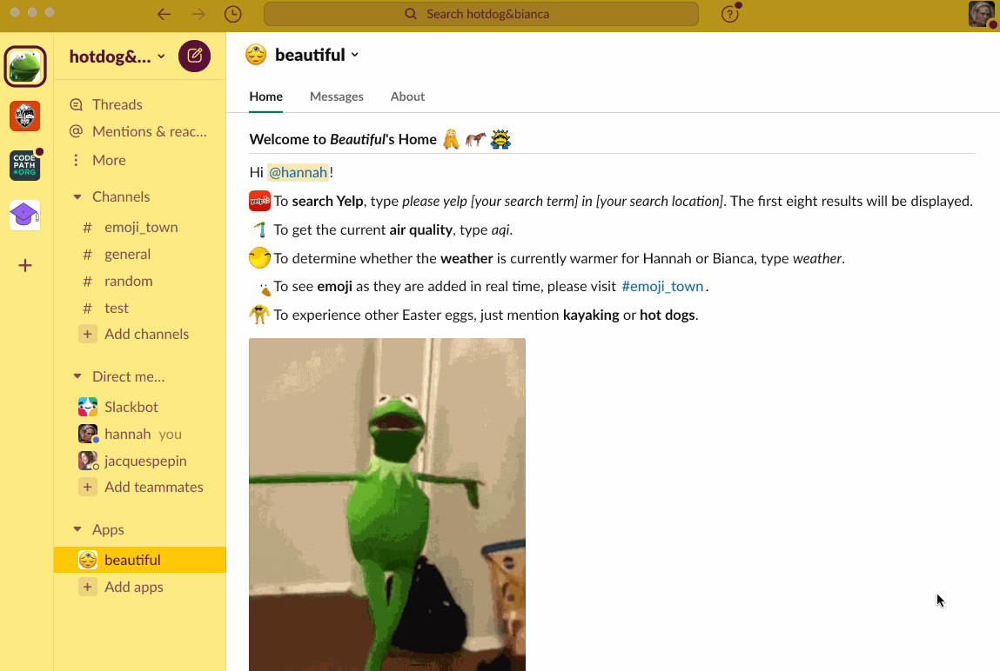
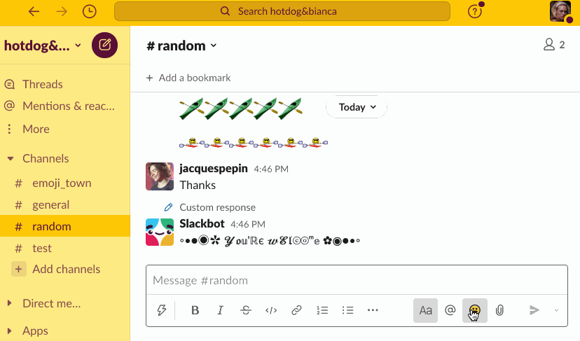
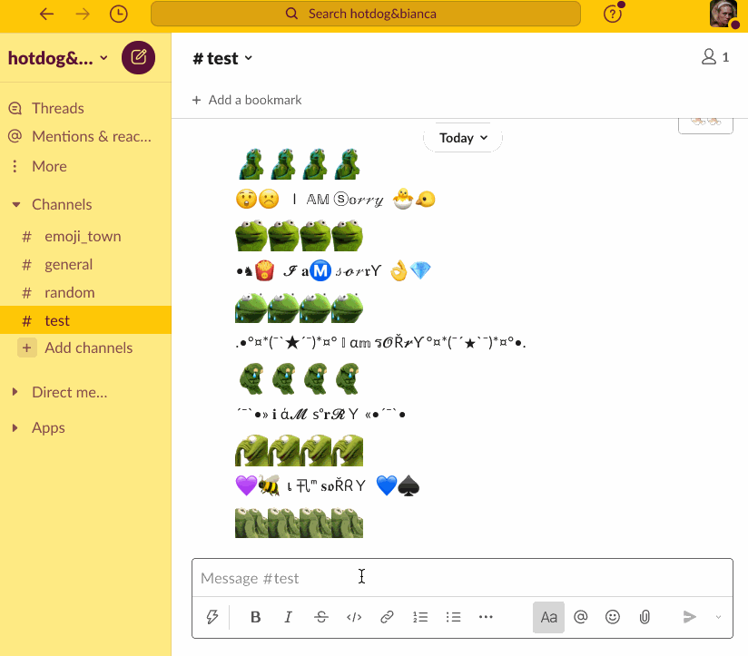
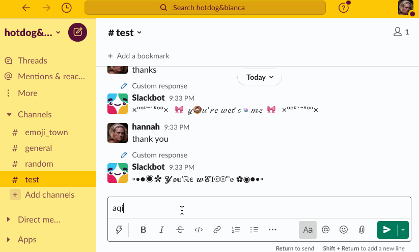
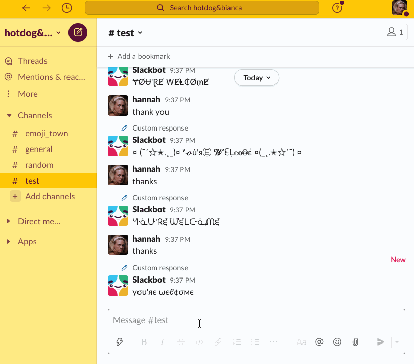

# beautiful

beautiful is a Slack app written using Bolt for Python. It includes:
- automated updates of an emoji tracking channel via the Slack API
- an analysis of whether it's hotter where I am or where Bianca is using calls to the OpenWeather API
- the ability to search Yelp using their API
- air quality assessment using PurpleAir
- a variety of annoying emoji-based Easter eggs

Here are those features in action:

App's home screen:

Emoji uploads:

Weather analysis:

Yelp:

Air quality analysis:

Easter eggs:

